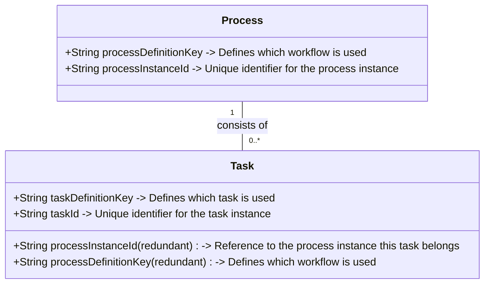

# Workflows

Workflows are displayed in Calypso under the "Aufgaben" (Tasks) and "Aufgabenarchiv" (Archived tasks) tabs on the left sidebar.

Tasks and archived tasks are managed by Team Sepia. They use [Camunda](https://camunda.com/) application to store this.

## Domain structure from Sepia:

### Definitions

- **Workflow**: A sequence of tasks that are executed to achieve a specific goal. Example: Follow-up workflow, Authority inquiry workflow, etc.
- **Process**: One instance of a workflow that is executed for a specific case. Example: An authority inquiry for a specific customer.
- **Task**: All steps that need to be completed in a process. Example: In case of an authority inquiry, the tasks could be: "Categorise inquiry", "Send response to authority", etc.

#### Diagram

## Calypso

### Aufgaben (Tasks)

- All tasks that are open are displayed.
- Queried from Sepia using GET /v2/frontend/tasks

### Aufgabenarchiv (Archived tasks)

- Even though the title says archived tasks, this tab shows all **processes** that are closed.
- Queried from Sepia using GET /v2/frontend/processes (by filtering for closed processes)
